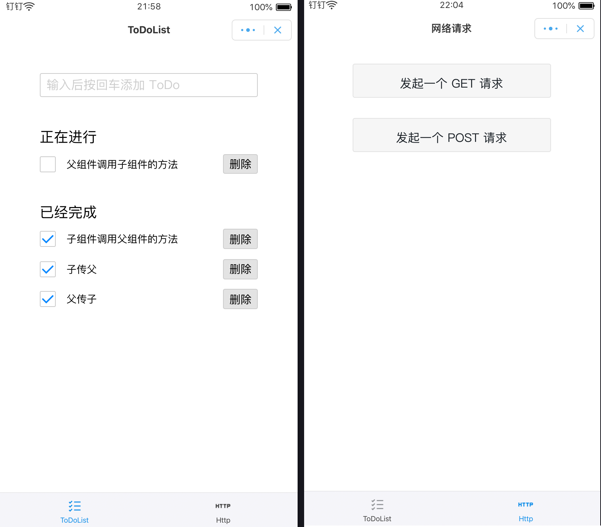

## 钉钉小程序

  

### 一、ToDoList 待解答的问题

- 1、axml 文件标签上如何使用 filter、map
- 2、[onChange](https://github.com/liuxy0551/DingTalk-ToDoList/blob/master/pages/todo/todo.js#L56) 方法中 setData 写法如何优化
- 3、onShow 如何调用自定义方法，目前是将自定义方法写在 Page.data 中

### 二、父子组件传值与事件调用

- [x] 1、父传子  
- [x] 2、子传父  
- [x] 3、子组件调用父组件的方法  
- [ ] 4、父组件调用子组件的方法  

### 三、封装网络请求

- [x] 1、get  
- [x] 2、post  
